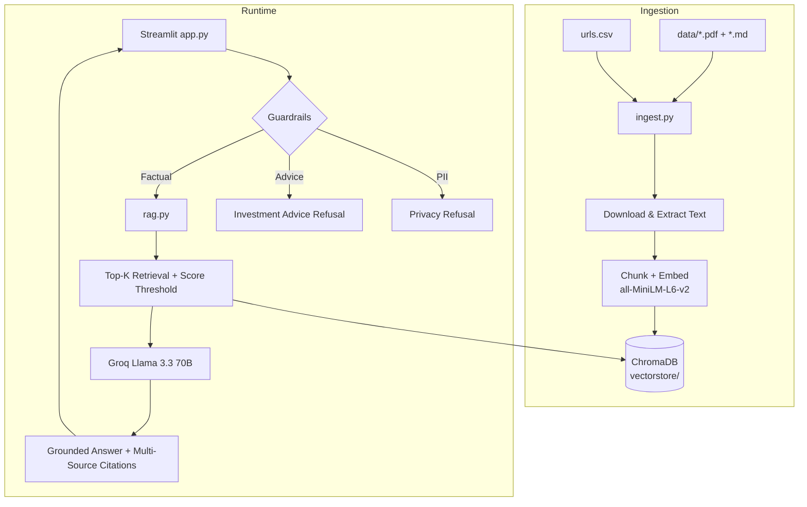

# RAG-Based Mutual Fund FAQ Assistant

[](https://github.com/coding-0418/RAG_Chatbot/actions/workflows/ci.yml)

A **facts-only** FAQ chatbot for mutual fund schemes across multiple AMCs. It answers factual questions about expense ratio, exit load, minimum SIP, lock-in period, risk-o-meter, benchmark, and KIM/SID — and **refuses** investment advice, comparisons, return predictions, and PII.

The knowledge base is **multi-AMC by design**: every source is tagged with the fund house (AMC) it belongs to, retrieval can be scoped to one AMC, and the UI's fund-house list and filter are generated from whatever is actually indexed — not hardcoded. See [Adding Another Fund House](#adding-another-fund-house) for how coverage grows.

**AMCs configured in `urls.csv`:** 25 major fund houses (SBI, HDFC, ICICI Prudential, Nippon India, Aditya Birla Sun Life, Kotak Mahindra, Axis, UTI, DSP, Tata, Franklin Templeton, Mirae Asset, Canara Robeco, PGIM India, Sundaram, Bandhan, HSBC, Motilal Oswal, PPFAS, quant, Quantum, Edelweiss, LIC, WhiteOak Capital, Baroda BNP Paribas) — each with its official homepage and Total Expense Ratio disclosure page. Run `python ingest.py` to actually index them.  
**Schemes with full detail:**
- **SBI:** SBI Bluechip Fund, SBI Contra Fund, SBI Long Term Equity Fund (ELSS), SBI Magnum Midcap Fund, SBI Small Cap Fund, SBI Equity Hybrid Fund, SBI Gilt Fund, SBI Nifty Index Fund, SBI Corporate Bond Fund
- **HDFC:** HDFC Flexi Cap Fund, HDFC Large Cap Fund, HDFC Mid-Cap Opportunities Fund, HDFC ELSS Tax Saver Fund, HDFC Balanced Advantage Fund, HDFC Corporate Bond Fund, HDFC Short Term Debt Fund, HDFC Nifty 50 Index Fund
- **ICICI Prudential:** Flexicap Fund, Large Cap Fund, ELSS Tax Saver Fund, MidCap Fund, Balanced Advantage Fund, Corporate Bond Fund, Nifty 50 Index Fund, Short Term Fund
- **Nippon India:** Large Cap Fund, Small Cap Fund, Flexi Cap Fund, ELSS Tax Saver Fund, Balanced Advantage Fund, Corporate Bond Fund, Index Fund (Nifty 50 Plan), Gilt Securities Fund
- **Aditya Birla Sun Life:** Frontline Equity Fund, Flexi Cap Fund, Midcap Fund, ELSS Tax Relief 96, Balanced Advantage Fund, Corporate Bond Fund, Nifty 50 Index Fund, Dynamic Bond Fund
- **Kotak Mahindra:** Flexicap Fund, Midcap Fund, Large Cap Fund (formerly Bluechip), ELSS Tax Saver Fund, Balanced Advantage Fund, Nifty 50 Index Fund, Corporate Bond Fund, Gilt Fund
- **Axis:** Bluechip Fund, Flexi Cap Fund, Mid Cap Fund, ELSS Tax Saver Fund (formerly Long Term Equity Fund), Balanced Advantage Fund, Nifty 100 Index Fund, Corporate Bond Fund, Banking and PSU Debt Fund
- **UTI:** Mastershare Unit Scheme, Flexi Cap Fund, Mid Cap Fund, ELSS Tax Saver Fund, Balanced Advantage Fund, Corporate Bond Fund, Nifty 50 Index Fund, Gilt Fund
- **DSP:** Flexi Cap Fund, Mid Cap Fund, Large Cap Fund (formerly Top 100 Equity Fund), ELSS Tax Saver Fund, Dynamic Asset Allocation Fund, Equity Savings Fund, Corporate Bond Fund, Nifty 50 Index Fund
- **Tata:** Large Cap Fund, Mid Cap Fund, Flexi Cap Fund, ELSS Tax Saver Fund, Balanced Advantage Fund, Corporate Bond Fund, Nifty 50 Index Fund, Short Term Bond Fund
- **Franklin Templeton:** Flexi Cap Fund, Large Cap Fund (formerly Bluechip), ELSS Tax Saver Fund, Small Cap Fund (formerly Smaller Companies Fund), Balanced Advantage Fund, Corporate Debt Fund, NSE Nifty 50 Index Fund, Banking and PSU Debt Fund
- **Mirae Asset:** ELSS Tax Saver Fund, Flexi Cap Fund, Midcap Fund, Large & Midcap Fund, Balanced Advantage Fund, Dynamic Bond Fund, Nifty 50 Index Fund, Corporate Bond Fund
- **Canara Robeco:** Bluechip Equity Fund, ELSS Tax Saver Fund, Emerging Equities Fund, Flexi Cap Fund
- **PGIM India:** Flexi Cap Fund, ELSS Tax Saver Fund, Large and Mid Cap Fund, Midcap Fund (formerly Midcap Opportunities Fund)
- **Sundaram:** Large and Mid Cap Fund, Flexi Cap Fund, Multi Cap Fund, Mid Cap Fund
- **Bandhan:** Flexi Cap Fund, Multi Cap Fund, Focused Equity Fund, Large Cap Fund
- **HSBC:** Large Cap Fund, Large and Mid Cap Fund, Multi Cap Fund, Flexi Cap Fund
- **Motilal Oswal:** Large and Midcap Fund, Flexi Cap Fund, Nifty Midcap 150 Index Fund, Midcap Fund
- **PPFAS:** Parag Parikh Flexi Cap Fund, ELSS Tax Saver Fund, Conservative Hybrid Fund, Liquid Fund
- **quant:** Flexi Cap Fund, ELSS Tax Saver Fund, Multi Cap Fund (formerly Active Fund), Small Cap Fund
- **Quantum:** ELSS Tax Saving Fund, Long Term Equity Value Fund, Ethical Fund
- **Edelweiss:** Flexi Cap Fund, Large Cap Fund, Multi Cap Fund, Mid Cap Fund
- **LIC:** Large Cap Fund, ELSS Tax Saver Fund, Large and Mid Cap Fund, Multi Cap Fund
- **WhiteOak Capital:** Flexi Cap Fund, Large Cap Fund, Large and Mid Cap Fund, ELSS Tax Saver Fund
- **Baroda BNP Paribas:** Flexi Cap Fund, Large Cap Fund, ELSS Tax Saver Fund, Mid Cap Fund

All 25 configured AMCs now have scheme-level depth. See [Adding Another Fund House](#adding-another-fund-house) to add a new AMC or deepen coverage further (additional schemes, factsheets, SID/KIM PDFs).

> **Disclaimer:** This assistant provides factual information from official mutual fund sources and does not provide investment advice, recommendations, return projections, or portfolio guidance.

---

## Architecture



| Component | Technology |
|-----------|------------|
| Frontend | Streamlit |
| LLM | Groq API (`llama-3.3-70b-versatile`) |
| Embeddings | Sentence Transformers `all-MiniLM-L6-v2` |
| Vector DB | ChromaDB |
| Framework | LangChain |
| Config | python-dotenv |

---

## Project Structure

```
mf_faq_chatbot/
├── app.py                # Streamlit UI (sidebar, session metrics, multi-turn chat)
├── ingest.py             # URL/PDF ingestion pipeline
├── rag.py                # Retrieval + guardrails + Groq generation
├── prompts.py            # System prompts and fixed responses
├── requirements.txt
├── requirements-dev.txt  # + pytest, ruff
├── pyproject.toml        # pytest / ruff config
├── Dockerfile
├── .dockerignore
├── README.md
├── urls.csv              # Source URLs, each tagged with its AMC (fund house)
├── sample_qa.md          # Evaluation Q&A pairs
├── .env.example
├── .streamlit/
│   └── config.toml       # Theme
├── data/                 # Local reference documents
├── vectorstore/          # ChromaDB persistence (created by ingest)
├── tests/                # pytest suite (guardrails, citations, end-to-end RAG)
└── docs/
    └── source_list.md    # Full source catalog
```

---

## Setup

### 1. Clone / enter project

```bash
cd mf_faq_chatbot
```

### 2. Create virtual environment

```bash
python3 -m venv .venv
source .venv/bin/activate   # Linux/macOS
# .venv\Scripts\activate  # Windows
```

### 3. Install dependencies

```bash
pip install -r requirements.txt
```

> First run downloads the embedding model (~90 MB). Ensure internet access.

### 4. Configure environment

```bash
cp .env.example .env
```

Edit `.env` and set your Groq API key:

```
GROQ_API_KEY=gsk_your_key_here
```

Obtain a free key at [https://console.groq.com/](https://console.groq.com/).

### 5. Run ingestion

```bash
python ingest.py
```

This will:

1. Read all URLs from `urls.csv`
2. Download and extract HTML/PDF content
3. Load local files from `data/`
4. Split into chunks and embed with `all-MiniLM-L6-v2`
5. Persist vectors to `vectorstore/`

Ingestion logs successes and failures per URL. Local reference files ensure baseline coverage even if some remote URLs are temporarily unavailable.

#### Adding Another Fund House

The pipeline and UI are AMC-agnostic — coverage grows by adding data, not by changing code. This is also how to deepen an already-listed AMC (e.g. adding SBI-style scheme/factsheet/SID/KIM rows for an AMC that currently only has homepage/TER coverage):

1. **Add rows to `urls.csv`** for the new AMC's official pages/PDFs (scheme pages, factsheets, SID/KIM, TER disclosure), filling the `amc` column with the fund house's name exactly as you want it shown (e.g. `HDFC Mutual Fund`). Cross-cutting regulator sources (SEBI, AMFI) should keep `amc` set to `Regulatory` — those are excluded from the fund-house picker since they aren't a single AMC.
2. **Optionally add local reference files** under `data/` and map the filename to an AMC in `LOCAL_FILE_AMC` in `ingest.py`.
3. **Re-run `python ingest.py`.** The new AMC appears automatically in the sidebar's fund-house list and filter dropdown — no `app.py` or `rag.py` changes needed.
4. **Verify sources before adding them.** `ingest.py` fetches live URLs at ingestion time; a wrong or dead URL just fails that one row (logged, skipped) rather than breaking the run, but a fabricated or unofficial source would silently degrade answer quality for that AMC. Only add pages you've confirmed are the AMC's own official disclosures.

Retrieval can be scoped to a single AMC (`MutualFundRAG.answer(question, amc="HDFC Mutual Fund")`, or via the sidebar dropdown in the UI) or left unscoped to search across every indexed fund house.

### 6. Launch Streamlit

```bash
streamlit run app.py
```

Open the URL shown in the terminal (typically `http://localhost:8501`).

---

## Testing

```bash
pip install -r requirements-dev.txt
pytest -v
```

The suite (`mf_faq_chatbot/tests/`) covers the investment-advice and PII guardrails, multi-source
citation deduplication, the retrieval score threshold, multi-turn history handling, and graceful
Groq-outage fallback — all with the embedding model, ChromaDB, and Groq LLM mocked out, so it runs
in well under a second with no network access or API key. `ruff check .` runs alongside it in CI
(`.github/workflows/ci.yml`) on every push and pull request.

---

## Deployment

A `Dockerfile` is provided for containerized deployment:

```bash
cd mf_faq_chatbot
docker build -t mf-faq-chatbot .

# Build the vector store once (persist it outside the container)
docker run --rm -v "$(pwd)/vectorstore:/app/vectorstore" --env-file .env mf-faq-chatbot python ingest.py

# Run the app against that vector store
docker run -p 8501:8501 -v "$(pwd)/vectorstore:/app/vectorstore" --env-file .env mf-faq-chatbot
```

For a managed environment (Kubernetes, ECS, Cloud Run, etc.), mount `vectorstore/` as a persistent
volume, inject `GROQ_API_KEY` via your platform's secrets manager rather than a plain `.env` file,
and run ingestion as a separate scheduled job so knowledge-base refreshes don't require redeploying
the app container.

---

## Usage

Ask factual questions such as:

- *What is the expense ratio of SBI Bluechip Fund?*
- *What is the lock-in period of SBI Long Term Equity Fund?*
- *What is the exit load of HDFC Flexi Cap Fund?*

Follow-up questions within the same session (e.g. *"What about the exit load?"* right after asking
about a specific fund) are resolved using the last couple of turns of conversation history.

The assistant will **not** answer:

- Investment recommendations
- Fund comparisons ("which is better")
- Buy/sell suggestions
- Return predictions
- Portfolio allocation advice

---

## Guardrails

| Trigger | Response |
|---------|----------|
| Investment advice patterns | Fixed SEBI-linked refusal message |
| PAN, Aadhaar, OTP, phone, email, account number | PII privacy warning |
| Missing context / weak retrieval match | "I could not find this information in the approved sources." |
| Groq API failure/timeout | Friendly "temporarily unavailable" message (logged, not a stack trace) |

Guardrails run **before** retrieval and generation — a blocked question never reaches the LLM.

Every factual answer is grounded in retrieved chunks and displayed with:

- The factual answer (max 3 sentences), generated with no free-text citation footer
- A **Citations** panel listing every distinct source URL actually used (deduplicated across
  retrieved chunks, not just the single top match) with its title and last-updated date
- A latency + source-chunk-count caption, for transparency into what was retrieved

Chunks whose retrieval distance exceeds `MAX_DISTANCE` (env-configurable, default `1.1`) are
dropped before generation rather than passed to the LLM as weak grounding — this is what backs the
"I could not find this information" response when nothing relevant enough was retrieved.

---

## Known Limitations

1. **Dynamic TER/NAV:** Expense ratios and NAV change frequently. Answers point to official TER/NAV pages; always verify latest figures on sbimf.com.
2. **Scheme renaming:** SBI Bluechip Fund is now SBI Large Cap Fund; ELSS is branded SBI ELSS Tax Saver Fund. The assistant uses official current names from sources.
3. **Web ingestion dependency:** `ingest.py` requires network access to fetch URLs. Some PDFs are large and may take time.
4. **JavaScript-heavy pages:** Scheme detail pages on sbimf.com may render minimal static HTML; SID/KIM PDFs and local reference files compensate.
5. **LLM variability:** Groq responses are temperature-0 but phrasing may differ slightly run-to-run while preserving facts.
6. **Full re-index on ingest:** `ingest.py` rebuilds the entire vector store rather than diffing changes — fine for a periodic scheduled job, but there's no incremental/delta ingestion yet.
7. **No authentication:** the Streamlit app has no login/SSO layer. A lightweight per-session rate limit is built in (throttles rapid repeat questions), but a shared-network deployment should sit behind SSO or a reverse-proxy auth layer before going further than a demo.
8. **Regex-based guardrails:** investment-advice and PII detection are pattern-based, not an LLM classifier — fast and dependency-free, but rephrasing can evade them. Treat as a first line of defense, not a compliance guarantee.
9. **Not every scheme per AMC:** `urls.csv` carries verified homepage, Total Expense Ratio, and scheme-level sources (individual scheme pages, factsheets, SID/KIM PDFs) for all 25 configured fund houses, but only for each AMC's 3-4 most popular schemes — not its entire fund lineup. A question about a scheme not yet in `urls.csv` will correctly answer "I could not find this information" rather than fabricate details. Add more scheme-level rows the same way (see [Adding Another Fund House](#adding-another-fund-house)) to widen coverage within an already-listed AMC.
10. **Cross-AMC comparison guardrail is unresolved:** the current guardrail blocks any "which fund is better" style comparison outright, including a neutral factual side-by-side (e.g. "what's each fund's expense ratio") across AMCs. Whether to allow that narrower case is a compliance decision that hasn't been made yet — until it is, comparisons stay blocked entirely.

---

## Evaluation Notes

Automated coverage lives in `mf_faq_chatbot/tests/` (run via `pytest`, see [Testing](#testing)) for
the guardrails, citation logic, and RAG response shape — those run on every push via CI.

`sample_qa.md` remains the manual, content-level test set (does the LLM actually get the *facts*
right against live sources) since that requires a real Groq call and live-sourced context:

- Expense ratio, exit load, minimum SIP, benchmark, risk-o-meter
- ELSS 3-year lock-in
- KIM/SID explanation
- Investment advice refusal
- PII detection

Suggested manual evaluation checklist:

- [ ] Factual answers cite at least one approved source URL (multiple when multiple sources
      genuinely contributed)
- [ ] Advice questions return exact refusal text
- [ ] PII in input triggers privacy message
- [ ] Out-of-scope / weakly-matched questions return the not-found message
- [ ] Answers stay within 3 factual sentences
- [ ] Follow-up questions in the same session resolve pronouns/references correctly
- [ ] UI shows disclaimer, examples, citations panel, and latency/source-count caption

---

## License

Educational / assignment submission project. Official fund data belongs to respective AMCs, SEBI, and AMFI.
