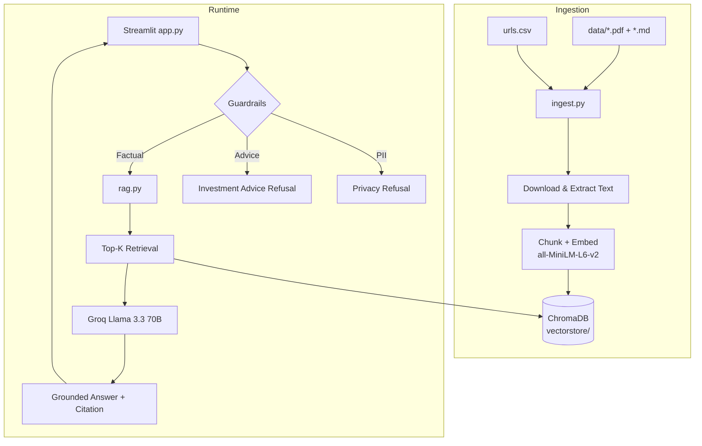

# RAG-Based Mutual Fund FAQ Assistant

A **facts-only** FAQ chatbot for SBI Mutual Fund schemes accessible on **Kuvera**. It answers factual questions about expense ratio, exit load, minimum SIP, lock-in period, risk-o-meter, benchmark, KIM/SID, and Kuvera statement downloads — and **refuses** investment advice, comparisons, return predictions, and PII.

**Platform:** Kuvera  
**AMC:** SBI Mutual Fund  
**Schemes:** SBI Bluechip Fund, SBI Contra Fund, SBI Long Term Equity Fund (ELSS), SBI Magnum Midcap Fund, SBI Small Cap Fund

> **Disclaimer:** This assistant provides factual information from official mutual fund sources and does not provide investment advice, recommendations, return projections, or portfolio guidance.

---

## Architecture



| Component | Technology |
|-----------|------------|
| Frontend | Streamlit |
| LLM | Groq API (`llama-3.3-70b-versatile`) |
| Embeddings | Sentence Transformers `all-MiniLM-L6-v2` |
| Vector DB | ChromaDB |
| Framework | LangChain |
| Config | python-dotenv |

---

## Project Structure

```
mf_faq_chatbot/
├── app.py              # Streamlit UI
├── ingest.py           # URL/PDF ingestion pipeline
├── rag.py              # Retrieval + guardrails + Groq generation
├── prompts.py          # System prompts and fixed responses
├── requirements.txt
├── README.md
├── urls.csv            # 23 official source URLs
├── sample_qa.md        # Evaluation Q&A pairs
├── .env.example
├── data/               # Local reference documents
├── vectorstore/        # ChromaDB persistence (created by ingest)
└── docs/
    └── source_list.md  # Full source catalog
```

---

## Setup

### 1. Clone / enter project

```bash
cd mf_faq_chatbot
```

### 2. Create virtual environment

```bash
python3 -m venv .venv
source .venv/bin/activate   # Linux/macOS
# .venv\Scripts\activate  # Windows
```

### 3. Install dependencies

```bash
pip install -r requirements.txt
```

> First run downloads the embedding model (~90 MB). Ensure internet access.

### 4. Configure environment

```bash
cp .env.example .env
```

Edit `.env` and set your Groq API key:

```
GROQ_API_KEY=gsk_your_key_here
```

Obtain a free key at [https://console.groq.com/](https://console.groq.com/).

### 5. Run ingestion

```bash
python ingest.py
```

This will:

1. Read all URLs from `urls.csv`
2. Download and extract HTML/PDF content
3. Load local files from `data/`
4. Split into chunks and embed with `all-MiniLM-L6-v2`
5. Persist vectors to `vectorstore/`

Ingestion logs successes and failures per URL. Local reference files ensure baseline coverage even if some remote URLs are temporarily unavailable.

### 6. Launch Streamlit

```bash
streamlit run app.py
```

Open the URL shown in the terminal (typically `http://localhost:8501`).

---

## Usage

Ask factual questions such as:

- *What is the expense ratio of SBI Bluechip Fund?*
- *What is the lock-in period of SBI Long Term Equity Fund?*
- *How do I download my capital gains statement on Kuvera?*

The assistant will **not** answer:

- Investment recommendations
- Fund comparisons ("which is better")
- Buy/sell suggestions
- Return predictions
- Portfolio allocation advice

---

## Guardrails

| Trigger | Response |
|---------|----------|
| Investment advice patterns | Fixed SEBI-linked refusal message |
| PAN, Aadhaar, OTP, phone, email, account number | PII privacy warning |
| Missing context | "I could not find this information in the approved sources." |

Every factual answer includes:

```
Source: <url>
Last updated from sources: <YYYY-MM-DD>
```

Answers are limited to **3 sentences** of factual content (plus citation lines).

---

## Known Limitations

1. **Dynamic TER/NAV:** Expense ratios and NAV change frequently. Answers point to official TER/NAV pages; always verify latest figures on sbimf.com.
2. **Scheme renaming:** SBI Bluechip Fund is now SBI Large Cap Fund; ELSS is branded SBI ELSS Tax Saver Fund. The assistant uses official current names from sources.
3. **Web ingestion dependency:** `ingest.py` requires network access to fetch URLs. Some PDFs are large and may take time.
4. **JavaScript-heavy pages:** Scheme detail pages on sbimf.com may render minimal static HTML; SID/KIM PDFs and local reference files compensate.
5. **No live account integration:** Kuvera answers describe platform steps only; the bot cannot access user accounts.
6. **LLM variability:** Groq responses are temperature-0 but phrasing may differ slightly run-to-run while preserving facts.

---

## Evaluation Notes

Use `sample_qa.md` for manual test cases covering:

- Expense ratio, exit load, minimum SIP, benchmark, risk-o-meter
- ELSS 3-year lock-in
- Kuvera statement and capital gains downloads
- KIM/SID explanation
- Investment advice refusal
- PII detection

Suggested evaluation checklist:

- [ ] Factual answers cite an approved source URL
- [ ] Advice questions return exact refusal text
- [ ] PII in input triggers privacy message
- [ ] Out-of-scope questions return not-found message
- [ ] Answers stay within 3 factual sentences
- [ ] UI shows disclaimer, examples, citations, and last-updated

---

## License

Educational / assignment submission project. Official fund data belongs to respective AMCs, SEBI, AMFI, and Kuvera.
